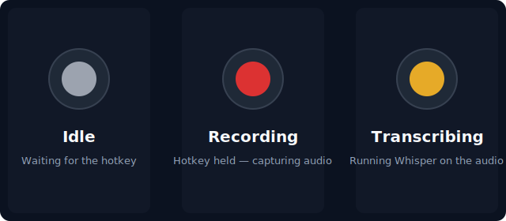

<p align="center">
  
</p>

<p align="center">
  <a href="LICENSE"></a>
  
  
  
  
</p>

# talk2computer

A local, private, free voice dictation tool — a Wispr Flow alternative. **No cloud, no subscription, no audio leaves your machine.** Hold a key, speak, release. The transcription is pasted into whatever app has focus and (by default) Enter is pressed for you.

## How it works


The system tray icon tells you what state the app is in:

<p align="center">
  
</p>

## Why it might be better than Wispr Flow for you

| | Wispr Flow | talk2computer |
|---|---|---|
| Trigger | Two-key shortcut | **One key** (configurable) |
| First-word clipping | Often clips first 1–2 words | **Captures from the first millisecond** |
| Submit | Manual Enter every time | **Auto-submits on release** (configurable) |
| Audio leaves machine | Yes | **No — 100% local** |
| Subscription | Paid | **Free, MIT-licensed** |
| Source code | Closed | **Open** |
| GPU acceleration | Cloud | **Local NVIDIA CUDA where available** |

## Install

Requires Python 3.10+.

### Windows with an NVIDIA GPU (recommended)

```powershell
git clone https://github.com/monk0062006/talk2computer.git
cd talk2computer
python -m venv .venv
.\.venv\Scripts\Activate.ps1
pip install -e ".[cuda]"
```

The `[cuda]` extra pulls cuBLAS/cuDNN/nvrtc (~1.5 GB) for GPU acceleration. Skip it (`pip install -e .`) if you don't have an NVIDIA GPU — the app falls back to CPU automatically.

### Windows CPU-only, macOS, or Linux

```bash
git clone https://github.com/monk0062006/talk2computer.git
cd talk2computer
python -m venv .venv
# macOS / Linux:
source .venv/bin/activate
# Windows PowerShell:
# .\.venv\Scripts\Activate.ps1
pip install -e .
```

First run downloads the chosen Whisper model (default `medium` on Windows-CUDA, `small` elsewhere) into the local Hugging Face cache. The download is a one-time ~500 MB – 1.5 GB depending on model size.

## macOS-specific setup

macOS requires two permissions in **System Settings → Privacy & Security**:

1. **Microphone** — to record audio.
2. **Accessibility** — for the global hotkey listener to see key presses and for the auto-paste to send Cmd+V.

When you first run the app, macOS pops up permission prompts. If it doesn't, grant them manually for your Python executable or the terminal app you launched from.

## Run

```bash
python -m talk2computer
```

A system tray icon appears. Hold the hotkey (default **Left Ctrl** on Windows/Linux, **Right Option** on macOS), speak, release.

## Demo

> *(Demo GIF coming soon — recording one in action.)*

## Configuration

Settings are stored in a JSON file you can edit:

- **Windows:** `%APPDATA%\talk2computer\config.json`
- **macOS:** `~/Library/Application Support/talk2computer/config.json`
- **Linux:** `~/.config/talk2computer/config.json`

| Field | Description |
|---|---|
| `model_size` | `tiny`, `base`, `small`, `medium`, `large-v3` |
| `device` | `cpu` or `cuda` (auto-falls-back to `cpu` if CUDA fails) |
| `compute_type` | `int8`, `float16`, `float32` |
| `language` | ISO code (e.g. `en`) or `null` for auto-detect |
| `hotkey` | pynput key name. Examples: `Key.ctrl_l`, `Key.ctrl_r`, `Key.alt_r`, `Key.caps_lock`, `Key.f12` |
| `auto_submit` | `true` to press Enter after pasting (submits chats, fires search) |
| `inject_method` | `paste` (clipboard + Ctrl/Cmd+V) or `type` (character-by-character) |

### Picking a model size

| Model | Size | Best for |
|---|---|---|
| `tiny` | 75 MB | Slow CPUs, casual dictation |
| `small` | 470 MB | CPU dictation, Apple Silicon |
| `medium` | 1.5 GB | NVIDIA GPU (≥4 GB VRAM) — sweet spot for dictation |
| `large-v3` | 3 GB | NVIDIA GPU (≥6 GB VRAM) — highest accuracy |

## Troubleshooting

**"I press the hotkey but nothing gets transcribed."**
- **Windows:** Press **Win+I** → Privacy & security → Microphone → make sure both "Microphone access" and "Let desktop apps access your microphone" are **On**.
- **macOS:** Grant **Microphone** and **Accessibility** permissions in System Settings → Privacy & Security.

**`RuntimeError: Library cublas64_12.dll is not found or cannot be loaded`**
- You installed without the `[cuda]` extra but set `device: cuda` in config. Either re-install with `pip install -e ".[cuda]"` or change `device` to `cpu` in the config file.

**The first few words of my sentence get cut off.**
- The model is still warming up on first launch. Wait until the tray icon is solid gray (idle) before dictating. After warmup, capture starts the moment you press the hotkey.

**Transcription is laggy.**
- Switch to a smaller model in the config (`small` or `base`) or, on Windows, install the `[cuda]` extra to use your GPU.

**The hotkey conflicts with my Ctrl+C / Ctrl+V shortcuts.**
- Change `hotkey` in the config to something less common — `Key.caps_lock`, `Key.f12`, or `Key.alt_r` are all good choices.

## Tech stack

- [`faster-whisper`](https://github.com/SYSTRAN/faster-whisper) — Whisper inference via CTranslate2 (CPU + CUDA)
- [`sounddevice`](https://python-sounddevice.readthedocs.io/) — microphone capture
- [`pynput`](https://pynput.readthedocs.io/) — global hotkey listener + keyboard simulation
- [`pyperclip`](https://pypi.org/project/pyperclip/) — clipboard handoff for fast paste
- [`pystray`](https://pystray.readthedocs.io/) — system tray icon
- `tkinter` — recording overlay

## License

MIT — see [LICENSE](LICENSE).
